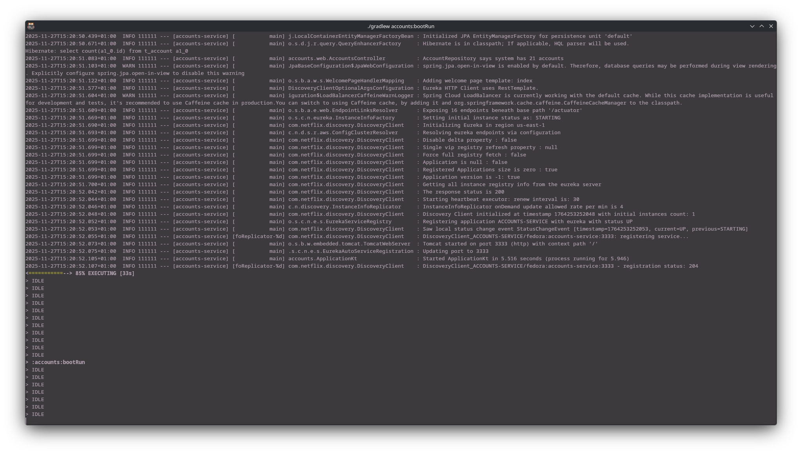
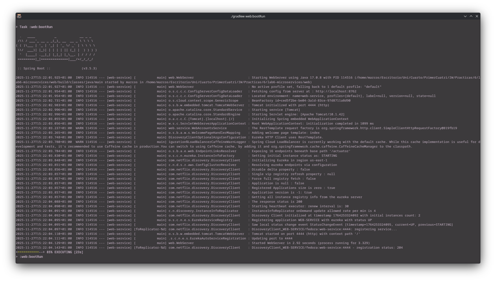
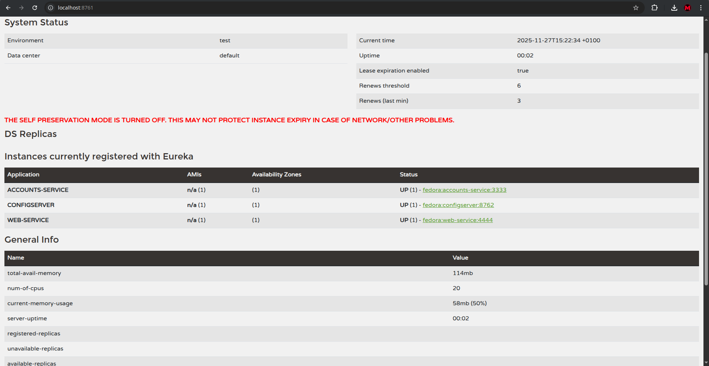
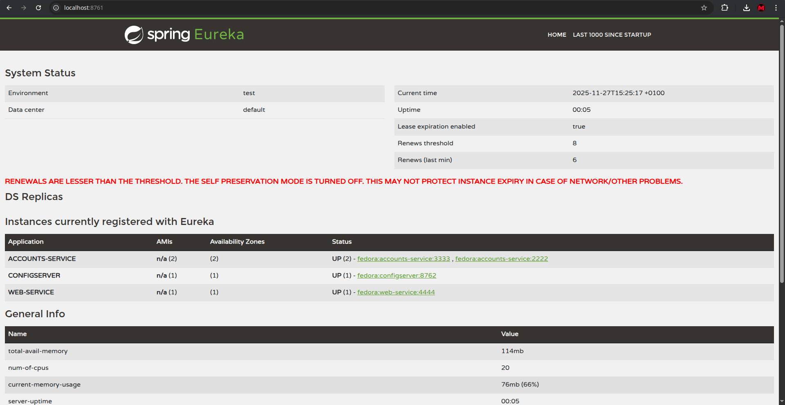
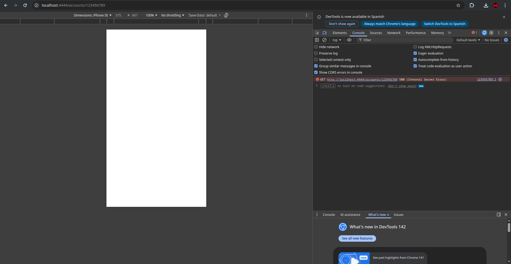
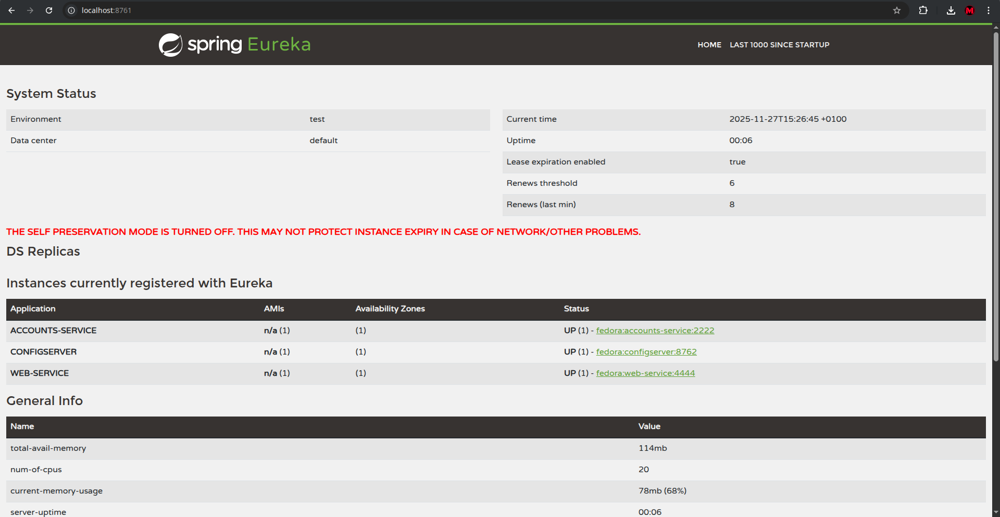
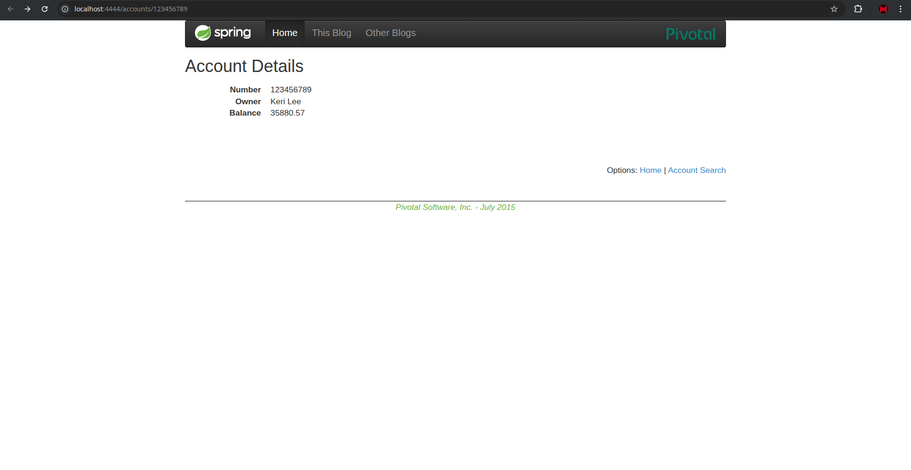

# Lab 6 Microservices - Project Report

## 1. Configuration Setup

**Configuration Repository**: https://github.com/Marcos1236/lab6-microservices.git

En cuanto a la configuración del repositorio, unicamente he modificado el `accounts-service.yml`. Concretamente modifiqué el campo server.port para correr un nuevo servicio de accounts en un puerto nuevo. Se utiliza configuración externa, de forma que la configuración está separada del código. Esto nos permite cambiar variables de entorno (como puertos o URLs) sin tener que recompilar `AccountsWebApplication`.

---

## 2. Service Registration (Task 1)

### Accounts Service Registration

Al iniciar `AccountsWebApplication`, el cliente de Spring Cloud Eureka inicia un proceso de registro. Envía una solicitud REST al servidor de Eureka (que se ejecuta en el puerto 8761). La entrada de registro `registration status: 204` indica una respuesta HTTP "Sin contenido" correcta del servidor, lo que confirma que los metadatos del servicio (IP, puerto e ID del servicio) se han aceptado y almacenado en el registro .

### Web Service Registration

El servicio web también se registra en Eureka al iniciarse. Para descubrir el servicio de cuentas, no utiliza una URL predefinida. En su lugar, utiliza una plantilla RestTemplate anotada con @LoadBalanced. Solicita el nombre lógico `http://ACCOUNTS-SERVICE`, que el cliente de Eureka resuelve a la dirección IP y el puerto disponibles (p. ej., localhost:3333), lo que permite la comunicación dinámica.

---

## 3. Eureka Dashboard (Task 2)

El panel confirma el estado actual del ecosistema de microservicios:
Enumera `ACCOUNTS-SERVICE`, `WEB-SERVICE` y `CONFIGSERVER`.
Para cada instancia registrada, Eureka muestra el nombre de la aplicación (ID del servicio), las AMI (número de instancias), las zonas de disponibilidad y el estado específico (ACTIVADO), junto con el enlace directo a la instancia (p. ej., `fedora:accounts-service:3333`).

---

## 4. Multiple Instances (Task 4)

- Al iniciarse la segunda instancia, obtiene la configuración actualizada (puerto 2222) del servidor de configuración y se registra en Eureka con el mismo nombre de aplicación (`ACCOUNTS-SERVICE`).
- Eureka detecta que ambos procesos comparten el mismo nombre de aplicación. Los lista como dos réplicas disponibles en la entrada `ACCOUNTS-SERVICE` del registro.
- El servicio web utiliza Spring Cloud LoadBalancer. Cuando necesita llamar al servicio de cuentas, recupera la lista de instancias disponibles (3333 y 2222) de Eureka y distribuye las solicitudes entre ellas (normalmente mediante una estrategia Round-Robin), asegurando que el tráfico se comparta.

---

## 5. Service Failure Analysis (Task 5)

### Initial Failure

Inmediatamente después de detener el servicio de cuentas en el puerto 3333, las solicitudes al servicio web fallan con un error interno del servidor (HTTP 500). Esto ocurre porque el balanceador de carga del lado del cliente aún mantiene la instancia terminada (puerto 3333) en su caché local e intenta enrutar el tráfico hacia ella antes de darse cuenta de que no se puede acceder a ella.

### Eureka Instance Removal

- Eureka tardó unos segundos en eliminar la instancia porque el `eviction-interval-timer-in-ms` estaba configurado en 1000 ms (1 segundo).
- Eureka utiliza un mecanismo de `latido`. Los servicios deben enviar un pulso de renovación periódicamente. Al detener el servicio, los latidos pararon. Ya que `enable-self-preservation` está configurado en `false`, Eureka consideró los latidos faltantes como una terminación y expulsó la instancia del registro.

---

## 6. Service Recovery Analysis (Task 6)

- El servicio web se recupera porque actualiza su registro local desde el servidor Eureka. Dado que Eureka ya expulsó el nodo inactivo (puerto 3333), la nueva lista obtenida por el cliente solo contiene la instancia en buen estado (puerto 2222).

- La recuperación tardó aproximadamente entre 30 y 60 segundos.

- El almacenamiento en caché del cliente desempeña un papel fundamental; el retraso en la recuperación se debe principalmente al tiempo que tarda el cliente en expirar su caché local y consultar Eureka para obtener la lista actualizada de servicios.

---

## 7. Conclusions

Gracias a esta práctica he entendido mucho mejor cómo los microservicios permiten separar la lógica y centralizar la configuración. El descubrimiento de servicios con Eureka es fundamental para entornos dinámicos, ya que elimina la necesidad de direcciones IP predefinidas. Pude comprobar que si un servicio cae, el tráfico se redirige solo a la instancia que queda viva, aunque noté que no es instantáneo por culpa de la caché. También me ha quedado claro que el orden de arranque es crítico: si no inicias Discovery y Config primero, los servicios no pueden registrarse.

---

## 8. AI Disclosure

Si, he utilizado Gemini.

El uso principal que le he dado a la herramienta ha sido el de entender como funcioa Eureka. En lo que respecta a la práctica no ha hecho falta utilizarla ya que el guión da instrucciones claras de lo que hay que ejecutar y de que capturas de pantalla debemos mostrar. También se ha utilizado Gemini para repasar errores de otrgorafía del report.

---

